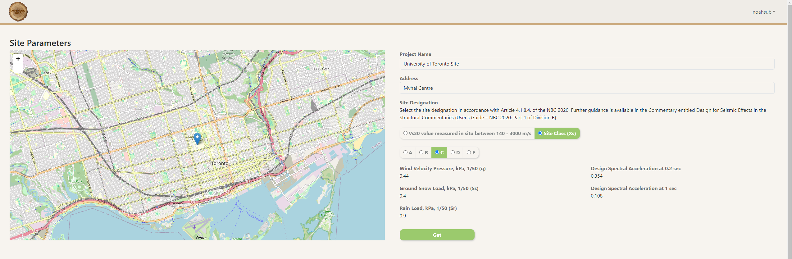

  

# Application of Specified Environmental Load Generator

The Application of Specified Environmental Load Generator (Aspenlog 2020) is an
online desktop application designed to calculate environmental loads (wind,
seismic, and snow) on building cladding components. These calculations are based
on Chapter 4 of the National Building Code of Canada (NBCC) 2020. The
application was developed by the University of Toronto Institute for
Multidisciplinary Design & Innovation (UT-IMDI) for SEEDA.

## Hosting the Backend
Refer to the installation guide in the `installation` directory.

## Running the Application
Simply install the latest release for your operating system from the releases page.

## Features
### Automatically Obtain Site Parameters for any Location in Canada

[//]: # (### Efficient Building Parameter Input)

[//]: # (![aspenlog2020]&#40;assets/images/building_parameters.png&#41;)
TODO
