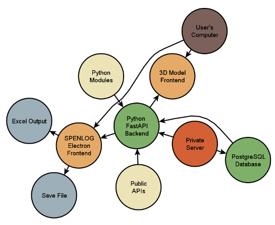

# Overview
This project requires the development of two software components: the Specified Environmental Load Generator (SPENLOG 2020) and a yet-to-be-named application capable of visualizing 3D models under various loads.
Given the intricate nature of this task, we need a comprehensive programming solution that includes a database, backend, and two frontends. This involves not only hosting our own database and APISs but also leveraging public APIs and frameworks.
The diagram below provides a more detailed overview of this process:

Breaking down the software development into such components instead of placing everything into a single offline application greatly increases the modularity of the program allowing for easier maintenance, better scalability, and improved flexibility. By leveraging databases and APIs, we can ensure that each component of the software can be developed, tested, and updated independently allowing for multiple developers to work on different parts of the program simultaneously without making disruptions to the entire application.
### Project Components
- **Specified Environmental Load Generator (SPENLOG 2020)**
- **Unnamed 3D Model Visualization Application**

### Programming Solution
- Requires a database backend.
- Two frontends.
- Utilization of both private and public APIs.

### Software Development Approach
- Modular approach for easier maintenance and scalability.
- Independent development, testing, and updating of software components.

### Private Server
- Hosting of the database and backend during the project.
- Post-completion, software can be hosted on any provider chosen by SEEDA.

### Backend and Database
- PostgreSQL database for storing data.
- Python code integrated with REST API.
- Frontend applications will retrieve data in JSON format.
- Use of Python modules (Seaborn, Matplotlib) and public APIs through the backend.

### Frontend
- Two separate frontends for the applications.
- Built using Electron platform and JavaScript.
- Compatibility across major platforms.
- Notable Electron framework use (e.g., Microsoft Teams, VS Code, Slack).

### SPENLOG 2020 Application
- Capability to export data in Excel format.
- Save and resume functionality using JSON serialization.

### Graphics
- Graphical User Interface (GUI) for interaction.
- SPENLOG Electron Frontend with 3D bar chart and tables.
- 3D model frontend for visualizing height zones and loads.
- Initial support for structures with simple shapes.
